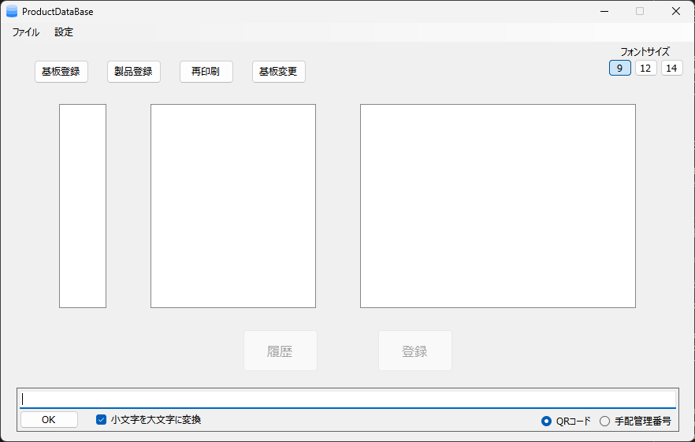
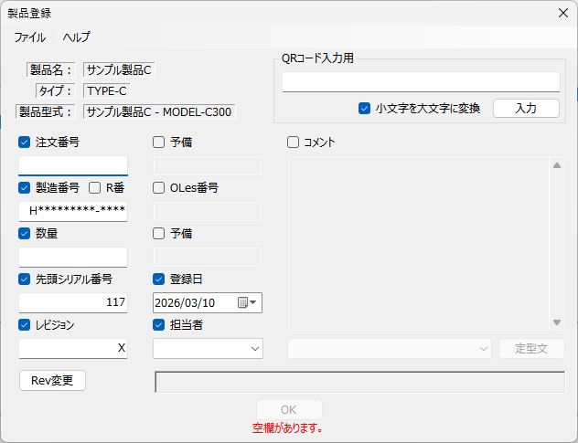
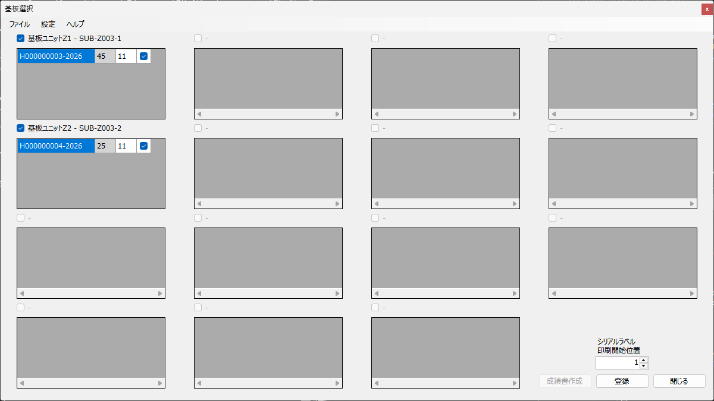
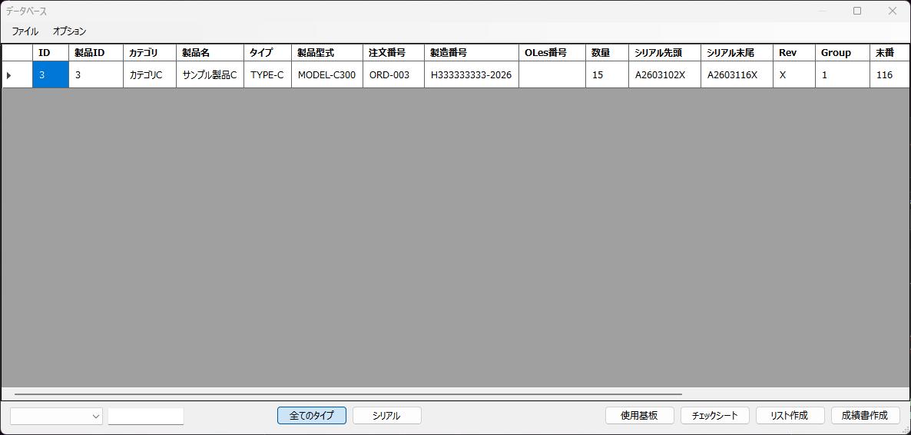

# ProductDatabase

製品・基板の登録管理およびシリアル番号の生成・印刷を行う Windows デスクトップアプリケーションです。
製造業における製品トレーサビリティとシリアル番号管理システムとして機能します。

---

## 機能概要

- **製品・基板の登録管理** — 2段階フローによる製品登録と基板在庫管理
- **シリアル番号の自動生成** — 製品カテゴリや設定に応じたシリアル番号の自動付番
- **ラベル・バーコード・銘板の印刷** — 各種印刷
- **成績書（Excel レポート）の生成** — テンプレートベースの自動帳票作成
- **再印刷機能** — 過去のシリアル番号を再度印刷
- **登録履歴の閲覧・管理** — 製品・基板・シリアルの履歴表示とフィルタリング
- **QR コード・バーコードスキャン** — スキャナ入力による製品検索
- **自動バックアップ** — DB のバックアップ管理

---

## 技術スタック

| カテゴリ | 技術 |
|---|---|
| 言語 | C# (.NET 8.0 / 10.0) |
| UI フレームワーク | Windows Forms (WinForms) |
| データベース | SQLite (Microsoft.Data.Sqlite + Dapper) |
| Excel 処理 | ClosedXML, EPPlus, NPOI |
| バーコード/QR コード | ZXing.Net |
| ラベル印刷 | Brother bPac (COM) |
| JSON | Newtonsoft.Json |

---

## 必要環境

- Windows 10 / 11
- .NET 8.0 Runtime 以上
- Microsoft Excel（成績書を開く場合）
- Brother P-touch ラベルプリンタ（シリアル印刷を使用する場合）
- bPac SDK（Brother 製ラベル印刷 SDK）

---

## ディレクトリ構成

```
ProductDataBase/
├── Launcher/                          # スプラッシュスクリーン付きランチャー
│   ├── Program.cs
│   └── SplashForm.cs
│
├── ProductDataBase/                   # メインアプリケーション
│   ├── MainWindow.cs                  # メインフォーム（製品/基板選択 UI）
│   ├── Program.cs
│   │
│   ├── Models/                        # データモデル
│   │   ├── ProductMaster.cs           # 製品マスター
│   │   ├── SubstrateMaster.cs         # 基板マスター
│   │   ├── ProductRegisterWork.cs     # 製品登録作業データ
│   │   ├── SubstrateRegisterWork.cs   # 基板登録作業データ
│   │   ├── AppSettings.cs             # アプリ設定
│   │   ├── Enums.cs                   # 列挙型定義
│   │   ├── PrintMasterBase.cs         # 印刷設定基底
│   │   └── SubstrateInfo.cs           # 基板情報
│   │
│   ├── Data/                          # データアクセス層
│   │   └── ProductRepository.cs       # リポジトリ
│   │
│   ├── Product/                       # 製品登録機能
│   │   ├── ProductRegistration1Window.cs  # Step1: 基本情報入力
│   │   ├── ProductRegistration2Window.cs  # Step2: 詳細確認・印刷
│   │   ├── SubstrateChange1.cs
│   │   └── SubstrateChange2.cs
│   │
│   ├── Substrate/                     # 基板登録機能
│   │   └── SubstrateRegistrationWindow.cs
│   │
│   ├── Print/                         # 印刷管理
│   │   ├── PrintManager.cs
│   │   └── PrintSettingsWindow.cs
│   │
│   ├── ExcelService/                  # 成績書生成
│   │   └── ExcelServiceClosedXml.cs
│   │
│   └── Other/                         # ユーティリティ・ダイアログ
│       ├── Constants.cs               # DB テーブル名定数
│       ├── DatabaseHelper.cs          # DB 接続設定
│       ├── CommonUtils.cs             # ログ・バックアップ・キーボード制御
│       ├── HistoryWindow.cs           # 履歴表示
│       └── RePrintWindow.cs           # 再印刷
│
└── ProductDataBase.sln
```

---

## 実行時フォルダ構成

```
実行ディレクトリ/
├── db/
│   ├── ProductRegistry.db            # メインデータベース（SQLite）
│   ├── backup/                        # 自動バックアップ（最大20件）
│   └── logs/                          # 操作ログ（月別 CSV）
├── Config/
│   ├── General/
│   │   ├── appsettings.json           # アプリ設定ファイル
│   │   └── Excel/
│   │       └── ConfigReport.xlsm      # 成績書テンプレート
│   ├── Product/
│   │   └── ProductMessages.json
│   └── Substrate/
│       └── SubstrateConfig.json       # 基板印刷設定
├── ProductDatabase.exe
└── Launcher.exe
```

---

## セットアップ

### 1. リポジトリのクローン

```bash
git clone https://github.com/keishi-99/ProductDataBase.git
cd ProductDataBase
```

### 2. ビルド

Visual Studio 2022 以上でソリューションを開くか、以下のコマンドを実行します。

```bash
dotnet build ProductDataBase.sln
```

### 3. 設定ファイルの編集

`Config/General/appsettings.json` を環境に合わせて編集します（テンプレート `Config/General/appsettings.template.json` を参照）。

```json
{
  "BackupFolderPath": "バックアップ先フォルダのパス",
  "Persons": ["担当者1", "担当者2"],
  "Administrators": ["管理者ユーザー名"],
  "AuthorizedUsers": ["認可ユーザー名"],
  "DSN": "ODBC DSN名（使用する場合）",
  "UID": "DBユーザー名（使用する場合）",
  "PWD": "DBパスワード（使用する場合）"
}
```

### 4. 実行

```bash
Launcher.exe
```

---

## データベース構成

SQLite ファイル（`db/ProductRegistry.db`）に以下のテーブル・ビューが含まれます。

| テーブル/ビュー | 説明 |
|---|---|
| `M_ProductDef` | 製品マスター |
| `M_SubstrateDef` | 基板マスター |
| `T_Product` | 製品登録実績 |
| `T_Substrate` | 基板登録実績 |
| `T_Serial` | シリアル番号記録 |
| `T_RePrint` | 再印刷履歴 |
| `V_Product` | 製品検索ビュー |
| `V_Substrate` | 基板検索ビュー |
| `V_ProductUseSubstrate` | 製品・基板関連ビュー |

---

## 操作フロー

```
起動（Launcher）
  └─ MainWindow（製品 / 基板 を選択）
       ├─ 製品登録
       │    ├─ Step1: 注文番号・製番・数量・シリアル番号入力
       │    └─ Step2: 詳細確認 → ラベル・成績書印刷
       ├─ 基板登録
       │    └─ 入庫・出庫・不良数を管理
       ├─ 再印刷
       │    └─ 過去シリアルの印刷履歴から再出力
       └─ 履歴表示
            └─ 製品 / 基板 / シリアルの履歴をフィルタ・ソート
```

---

## セキュリティ・安定性

- **多重起動防止** — Mutex によるプロセス制御
- **ユーザー認証** — Windows ユーザー名と設定ファイルによる管理者/認可ユーザー分離
- **自動バックアップ** — 起動時に DB を自動バックアップ（最大20件保持）
- **操作ログ** — 全操作を月別 CSV ファイルに記録

---

## スクリーンショット






---

## ライセンス

本プロジェクトのライセンスについては、リポジトリオーナーにお問い合わせください。
