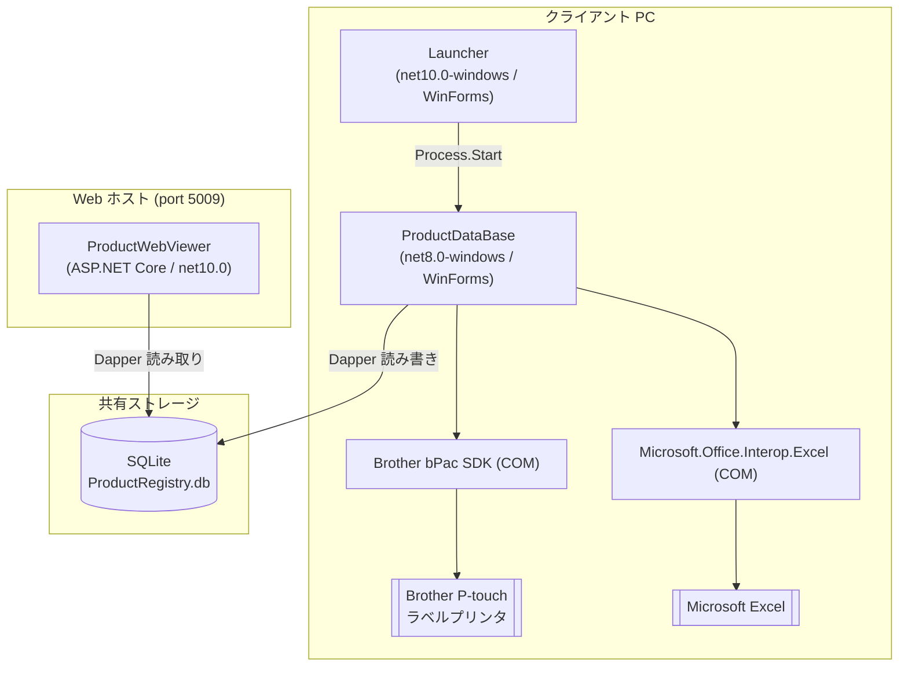
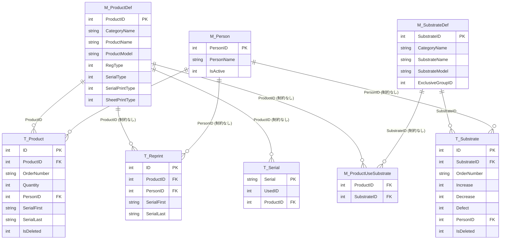
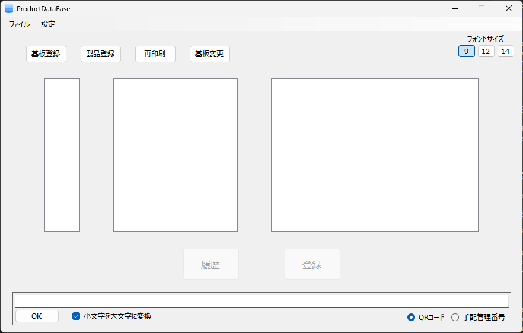
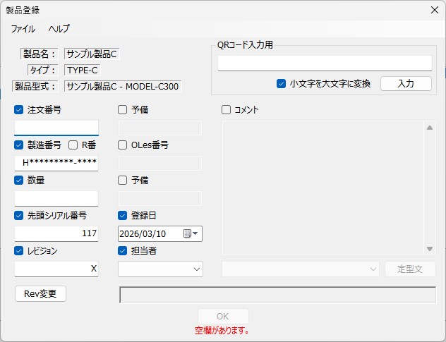
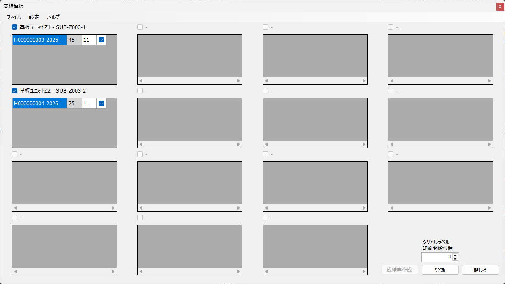
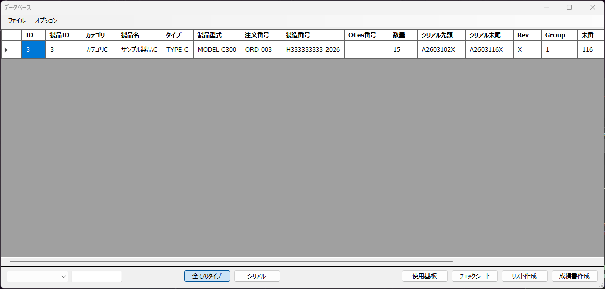

# ProductDatabase

製品・基板の登録管理およびシリアル番号の生成・印刷を行う Windows デスクトップアプリケーションです。
製造業における製品トレーサビリティとシリアル番号管理システムとして機能します。

---

## 機能概要

- **製品・基板の登録管理** — 2段階フローによる製品登録と基板在庫管理
- **サービス向け製品登録** — カテゴリ選択による簡易登録フロー
- **シリアル番号の自動生成** — 製品カテゴリや設定に応じたシリアル番号の自動付番
- **ラベル・バーコード・銘板の印刷** — 各種印刷
- **成績書（Excel レポート）の生成** — テンプレートベースの自動帳票作成（成績書・チェックシート・一覧表・基板情報）
- **再印刷機能** — 過去のシリアル番号を再度印刷
- **登録履歴の閲覧・管理** — 製品・基板・シリアルの履歴表示・フィルタリング・編集
- **QR コード・バーコードスキャン** — スキャナ入力による製品検索
- **自動バックアップ** — DB のバックアップ管理
- **マスター管理** — 製品定義 / 基板定義 / 製品使用基板の追加・編集・削除

---

## 技術スタック

| カテゴリ | 技術 |
|---|---|
| 言語 | C# (.NET 8.0) |
| UI フレームワーク | Windows Forms (WinForms) |
| データベース | SQLite (Microsoft.Data.Sqlite + Dapper) |
| Excel 処理 | ClosedXML, EPPlus, NPOI |
| バーコード/QR コード | ZXing.Net |
| ラベル印刷 | Brother bPac (COM) |
| Excel 起動 | Microsoft.Office.Interop.Excel (COM) |

---

## システム構成図

3つのプロジェクトはコード上の参照関係を持たず、SQLite ファイル（`ProductRegistry.db`）を介して疎結合しています。Launcher はプロセス起動（`Process.Start`）で ProductDataBase を呼び出すだけで、アセンブリ参照はありません。


```mermaid
graph TB
    subgraph Client["クライアント PC"]
        Launcher["Launcher<br/>(net10.0-windows / WinForms)"]
        ProductDataBase["ProductDataBase<br/>(net8.0-windows / WinForms)"]
        bPac["Brother bPac SDK (COM)"]
        ExcelInterop["Microsoft.Office.Interop.Excel (COM)"]
        Printer[["Brother P-touch<br/>ラベルプリンタ"]]
        Excel[["Microsoft Excel"]]
    end

    subgraph Storage["共有ストレージ"]
        DB[("SQLite<br/>ProductRegistry.db")]
    end

    subgraph WebHost["Web ホスト (port 5009)"]
        ProductWebViewer["ProductWebViewer<br/>(ASP.NET Core / net10.0)"]
    end

    Launcher -- "Process.Start" --> ProductDataBase
    ProductDataBase -- "Dapper 読み書き" --> DB
    ProductDataBase --> bPac --> Printer
    ProductDataBase --> ExcelInterop --> Excel
    ProductWebViewer -- "Dapper 読み取り" --> DB
```

---

## 工夫した点

- **3プロジェクトの疎結合構成** — Launcher / ProductDataBase / ProductWebViewer はアセンブリ参照を持たず、SQLite ファイルのみを介して連携。TFM が異なる（.NET 8 / .NET 10）プロジェクト間でも依存を持たずに済む構成
- **ビットフラグ方式のシリアル種別設計** — `SerialType` / `SerialPrintType` を単一 int のビットフラグで表現し、複数の印刷・付番パターンを1カラムで管理（詳細は `sql.md`）
- **Excel 帳票の自動生成** — テンプレートベースで成績書・チェックシート・一覧表・基板情報を自動出力
- **多重起動防止・自動バックアップ・操作ログ** — Mutex によるプロセス制御、起動時 DB バックアップ（最大20件）、月別 CSV 操作ログ

## 技術選定理由

- **SQLite** — 社内の製品管理用PC1台のみで運用するため採用
- **Dapper** — SQL を直接書けるため採用
- **Excel処理の使い分け（ClosedXML / EPPlus / NPOI）** — 各ライブラリごとに問題点があったため使い分け

---

## 必要環境

- Windows 10 / 11
- .NET 8.0 Runtime 以上
- Microsoft Excel（成績書を開く場合）
- Brother P-touch ラベルプリンタ（シリアル印刷を使用する場合）
- bPac SDK（Brother 製ラベル印刷 SDK）

---

## セットアップ

`Config/General/appsettings.json` を環境に合わせて編集します（テンプレート `Config/General/appsettings.template.json` を参照）。

```json
{
  "BackupFolderPath": "バックアップ先フォルダのパス",
  "Persons": ["担当者1", "担当者2"],
  "Administrators": ["管理者ユーザー名"],
  "AuthorizedUsers": ["認可ユーザー名"],
  "DSN": "ODBC DSN名（使用する場合）",
  "UID": "DBユーザー名（使用する場合）",
  "PWD": "DBパスワード（使用する場合）"
}
```

---

## データベース構成

SQLite ファイル（`db/ProductRegistry.db`）に以下のテーブル・ビューが含まれます。

| テーブル/ビュー | 説明 |
|---|---|
| `M_ProductDef` | 製品マスター |
| `M_SubstrateDef` | 基板マスター |
| `M_ProductUseSubstrate` | 使用基板マスター |
| `M_Person` | 担当者マスター |
| `T_Product` | 製品登録実績 |
| `T_Substrate` | 基板登録実績 |
| `T_Serial` | シリアル番号記録 |
| `T_Reprint` | 再印刷履歴 |
| `V_Product` | 製品検索ビュー |
| `V_Substrate` | 基板検索ビュー |
| `V_ProductUseSubstrate` | 使用基板ビュー |
| `V_Reprint` | 再印刷検索ビュー |
| `V_Serial` | シリアル検索ビュー |

### ER図

外部キー制約があるのは `T_Product.ProductID` と `T_Substrate.SubstrateID` のみです。`PersonID` などその他の関連は View 側の JOIN でのみ結び付く論理的な関連であり、DB 上の制約はありません。


```mermaid
erDiagram
    M_ProductDef ||--o{ T_Product : "ProductID"
    M_ProductDef ||--o{ T_Reprint : "ProductID (制約なし)"
    M_ProductDef ||--o{ T_Serial : "ProductID (制約なし)"
    M_ProductDef ||--o{ M_ProductUseSubstrate : "ProductID (制約なし)"
    M_SubstrateDef ||--o{ T_Substrate : "SubstrateID"
    M_SubstrateDef ||--o{ M_ProductUseSubstrate : "SubstrateID (制約なし)"
    M_Person ||--o{ T_Product : "PersonID (制約なし)"
    M_Person ||--o{ T_Substrate : "PersonID (制約なし)"
    M_Person ||--o{ T_Reprint : "PersonID (制約なし)"

    M_ProductDef {
        int ProductID PK
        string CategoryName
        string ProductName
        string ProductModel
        int RegType
        int SerialType
        int SerialPrintType
        int SheetPrintType
    }
    M_SubstrateDef {
        int SubstrateID PK
        string CategoryName
        string SubstrateName
        string SubstrateModel
        int ExclusiveGroupID
    }
    M_ProductUseSubstrate {
        int ProductID FK
        int SubstrateID FK
    }
    M_Person {
        int PersonID PK
        string PersonName
        int IsActive
    }
    T_Product {
        int ID PK
        int ProductID FK
        string OrderNumber
        int Quantity
        int PersonID FK
        string SerialFirst
        string SerialLast
        int IsDeleted
    }
    T_Substrate {
        int ID PK
        int SubstrateID FK
        string OrderNumber
        int Increase
        int Decrease
        int Defect
        int PersonID FK
        int IsDeleted
    }
    T_Serial {
        string Serial PK
        int UsedID
        int ProductID FK
    }
    T_Reprint {
        int ID PK
        int ProductID FK
        int PersonID FK
        string SerialFirst
        string SerialLast
    }
```

---

## 操作フロー

```
起動（Launcher）
  └─ MainWindow（製品 / 基板 を選択）
       ├─ 製品登録
       │    ├─ Step1: 注文番号・製番・数量・シリアル番号入力
       │    └─ Step2: 詳細確認 → ラベル・成績書印刷
       ├─ サービス向け製品登録
       │    └─ カテゴリ選択 → 製品選択 → 登録
       ├─ 基板登録
       │    └─ 入庫・出庫・不良数を管理
       ├─ 再印刷
       │    └─ 過去シリアルの印刷履歴から再出力
       ├─ 履歴表示
       │    └─ 製品 / 基板 / シリアルの履歴をフィルタ・ソート・編集
       └─ マスター管理
            ├─ 製品マスター（追加・編集・削除・検索・ソート）
            ├─ 基板マスター（追加・編集・削除・検索・ソート）
            └─ 製品使用基板（製品に紐づく基板の管理）
```

---

## セキュリティ・安定性

- **多重起動防止** — Mutex によるプロセス制御
- **ユーザー認証** — Windows ユーザー名と設定ファイルによる管理者/認可ユーザー分離
- **自動バックアップ** — 起動時に DB を自動バックアップ（最大20件保持）
- **操作ログ** — 全操作を月別 CSV ファイルに記録

---

## スクリーンショット






---
